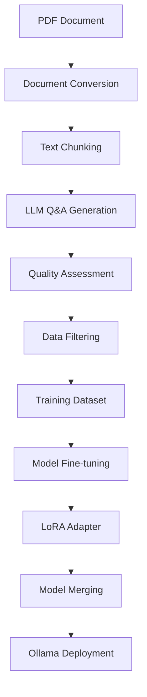

# RTX 3050(4GB VRAM) – Fine-Tuning Llama 3.2 Experiment

Fine tuned Llama-3.2-1B with research paper - Deep Reinforcement Learning For Power Frid Multi-Stage Cascading Failure Mitigations. This project transforms academic research papers into an interactive AI assistant through synthetic data generation and supervised fine-tuning.

## All done in my RTX 3050 GB VRAM

## 🎯 Project Overview

This repository implements a complete end-to-end pipeline that:
1. **Processes academic PDFs** using advanced document chunking
2. **Generates synthetic Q&A datasets** using gemini/kimi-k2-instruct
3. **Evaluates data quality** using gemini/kimi-k2-instruct
4. **Fine-tunes language models** using QLoRA
5. **Deploys via Ollama** for easy local inference

## 🏗️ Architecture



## 📁 Project Structure

```
finetune/
├── 📄 DRL.pdf                    # Source research paper
├── 📄 drl-adapter.gguf          # Trained adapter model
├── 📄 Modelfile                 # Ollama configuration
├── 📂 data/                     # Training datasets
│   └── 📄 instruction_format.json
├── 📂 final_model/              # Merged model outputs
├── 📄 syntheticdatageneration.py # PDF → Q&A generation
├── 📄 preprocessing.py          # Data format conversion
├── 📄 dataquality.py           # Quality assessment
├── 📄 train.py                 # Model fine-tuning
├── 📄 merge.py                 # Model merging
├── 📄 generated_prompt.py      # Q&A generation prompts
└── 📄 .env                     # API keys (git-ignored)
```

## 🚀 Quick Start

### Prerequisites
- Python 3.12+
- CUDA-capable GPU (4GB+ VRAM recommended)
- API keys for Gemini, OpenRouter, Groq, HuggingFace

### Installation

1. **Clone and setup environment:**
   ```bash
   git clone https://github.com/Sidharth1743/FT-Llama3.2-1B.git
   cd Fine_tuning_1
   uv sync
   ```

2. **Configure API keys:**
   ```bash
   cp .env.example .env
   # Edit .env with your API keys
   ```

3. **Run the complete pipeline:**
   ```bash
   ##Run with uv instead of python
   uv run train.py
   # Step 1: Generate synthetic data from PDF
   python syntheticdatageneration.py
   
   # Step 2: Preprocess data for training
   python preprocessing.py
   
   # Step 3: Assess data quality
   python dataquality.py
   
   # Step 4: Fine-tune the model
   python train.py
   
   # Step 5: Merge adapter with base model
   python merge.py
   ```

## Pipeline Components

### 1. Document Processing (`syntheticdatageneration.py`)
- **Purpose**: Converts PDF documents into structured Q&A pairs
- **Technology**: Docling for PDF processing, Gemini-2.0-Flash for generation
- **Output**: `DRL.json` containing contextualized Q&A datasets

### 2. Quality Assessment (`dataquality.py`)
- **Purpose**: Evaluates generated Q&A pairs for accuracy and style
- **Technology**: Groq/Kimi-K2-Instruct for evaluation
- **Output**: Quality-scored datasets with explanations

**Scoring Criteria:**
- **Accuracy** (1-10): Factual correctness and completeness
- **Style** (1-10): Clarity, coherence, and professionalism
- **Filtering**: Only pairs with scores ≥6 on both dimensions

### 3. Data Preprocessing (`preprocessing.py`)
- **Purpose**: Converts raw Q&A pairs into training format
- **Output**: HuggingFace datasets in instruction-following format

### 4. Model Training (`train.py`)
- **Purpose**: Fine-tunes Llama-3.2-1B on domain-specific data
- **Technology**: 
  - 4-bit quantization with BitsAndBytes
  - LoRA adapters (rank=256, α=512)
  - SFTTrainer with optimized hyperparameters
- **Hardware**: Optimized for 4GB GPUs

**Training Configuration:**
- Base Model: `meta-llama/Llama-3.2-1B`
- Quantization: 4-bit NF4 with double quantization
- LoRA: Rank 256, α=512, 0.05 dropout
- Batch Size: 1 (gradient accumulation ×4)
- Context Length: 512 tokens
- Precision: BF16

### 5. Model Merging (`merge.py`)
- **Purpose**: Converts to GGUF and Merges LoRA adapters into base model
- **Output**: Production-ready merged model

### 6. Deployment (`Modelfile`)
- **Purpose**: Ollama-compatible model configuration
- **Usage**: `ollama create power-grid-assistant -f Modelfile`

## 🔧 Configuration

### Environment Variables (.env)
```bash
# Gemini API Keys (different endpoints)
GEMINI_API_KEY_DATAQUALITY=your_gemini_key_here
GEMINI_API_KEY_SYNTHETIC=your_gemini_key_here

# Other API Services
OPENROUTER_API_KEY=your_openrouter_key_here
GROQ_API_KEY=your_groq_key_here
HF_TOKEN=your_huggingface_token_here
```
